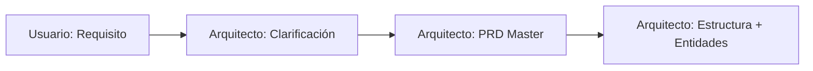
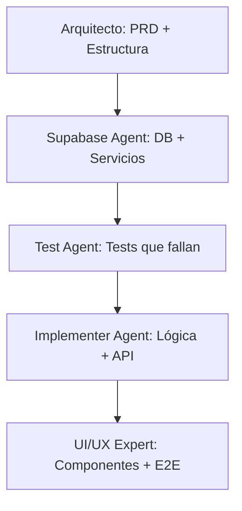

# Guía de Uso del Sistema de PRDs

## 📋 Tabla de Contenidos
1. [Introducción](#introducción)
2. [Estructura del Sistema](#estructura-del-sistema)
3. [Flujo de Trabajo](#flujo-de-trabajo)
4. [Plantillas Disponibles](#plantillas-disponibles)
5. [Convenciones de Naming](#convenciones-de-naming)
6. [Roles y Responsabilidades](#roles-y-responsabilidades)
7. [Proceso de Creación](#proceso-de-creación)
8. [Tracking y Monitoreo](#tracking-y-monitoreo)
9. [Mejores Prácticas](#mejores-prácticas)
10. [Troubleshooting](#troubleshooting)

---

## Introducción

Este sistema de PRDs (Product Requirements Documents) está diseñado para mantener la organización, trazabilidad y coherencia en el desarrollo de features usando nuestro ecosistema de agentes especializados.

### Objetivos del Sistema
- **Organización:** Estructura clara y escalable para documentación
- **Trazabilidad:** Seguimiento completo desde requisito hasta implementación
- **Coherencia:** Estándares uniformes para todos los agentes
- **Eficiencia:** Plantillas reutilizables y procesos optimizados
- **Calidad:** Validación y revisión en cada etapa

---

## Estructura del Sistema

### Directorio Principal: `/PRDs/`

```
PRDs/
├── _templates/                    # Plantillas reutilizables
│   ├── 00-master-prd-template.md
│   ├── 01-supabase-template.md
│   ├── 02-test-template.md
│   ├── 03-implementation-template.md
│   ├── 04-ui-template.md
│   ├── rls-migration-template.md  # Template para políticas RLS
│   └── _status-template.md
│
├── _examples/                     # Ejemplos de referencia
│   └── 001-example-feature/
│
├── tasks/                         # Features relacionadas con tareas
│   ├── 001-create-task/
│   ├── 002-edit-task/
│   └── 003-task-comments/
│
├── projects/                      # Features relacionadas con proyectos
│   ├── 001-create-project/
│   └── 002-project-members/
│
├── auth/                          # Features de autenticación
│   ├── 001-user-registration/
│   ├── 002-login-logout/
│   └── 003-password-reset/
│
└── GUIA-USO-PRD.md               # Esta guía
```

### Estructura de Feature Individual

```
[domain]/[number]-[feature-name]/
├── 00-master-prd.md              # PRD principal (Arquitecto)
├── 01-supabase-spec.md           # Especificaciones de DB (Supabase Agent)
├── 02-test-spec.md               # Especificaciones de testing (Test Agent)
├── 03-implementation-spec.md     # Guía de implementación (Implementer Agent)
├── 04-ui-spec.md                 # Especificaciones de UI/UX (UI/UX Expert Agent)
└── _status.md                    # Tracking de estado y progreso
```

---

## Flujo de Trabajo

### 1. Inicio del Proyecto (Usuario Humano → Arquitecto)


### 2. Desarrollo Secuencial por Agentes


### 3. Tracking Continuo
- Cada agente actualiza `_status.md` al completar su trabajo
- El estado se monitorea en tiempo real
- Los bloqueadores se identifican y resuelven rápidamente

---

## Plantillas Disponibles

### 📋 00-master-prd-template.md
**Usado por:** Arquitecto  
**Propósito:** Definir requisitos completos y contratos de datos  
**Secciones clave:**
- User Story y contexto de negocio
- Criterios de aceptación funcionales y no funcionales
- Contratos de datos con schemas de Zod
- Contratos de API endpoints
- Especificaciones de UI/UX
- Consideraciones técnicas

### 🗄️ 01-supabase-template.md
**Usado por:** Supabase Agent
**Propósito:** Implementar infraestructura de base de datos
**Secciones clave:**
- Schema de base de datos con SQL
- Políticas de Row Level Security (RLS)
- Servicios de datos (Data Access Layer)
- Migraciones y funciones de BD
- Validaciones y constraints

### 🔐 rls-migration-template.md
**Usado por:** Supabase Agent
**Propósito:** Template SQL para crear políticas RLS optimizadas y sin conflictos
**Secciones clave:**
- Documentación obligatoria de consulta a Context7
- Funciones security definer para evitar políticas circulares
- Políticas RLS con mejores prácticas (SELECT, INSERT, UPDATE, DELETE)
- Checklist de verificación de performance (EXPLAIN ANALYZE)
- Anti-patterns explícitos a evitar
- Validación post-implementación

**Uso obligatorio:**
- SIEMPRE consultar Context7 antes de usar este template
- Documentar findings en la sección de verificación
- Ejecutar `/validate-rls` después de crear la migración
- Verificar índices en todas las columnas usadas en políticas

### 🧪 02-test-template.md
**Usado por:** Test Agent  
**Propósito:** Crear suite completa de tests que fallan  
**Secciones clave:**
- Tests unitarios de use cases
- Tests de integración de API endpoints
- Estrategia de mocking
- Tests de performance y seguridad
- Cobertura y métricas

### ⚙️ 03-implementation-template.md
**Usado por:** Implementer Agent  
**Propósito:** Implementar lógica de negocio y API  
**Secciones clave:**
- Use cases con validaciones de negocio
- API endpoints con manejo de errores
- Autenticación y autorización
- Optimizaciones de performance
- Logging y monitoreo

### 🎨 04-ui-template.md
**Usado por:** UI/UX Expert Agent  
**Propósito:** Crear interfaz de usuario completa  
**Secciones clave:**
- Componentes de React con shadcn/ui
- Integración con API usando TanStack Query
- Tests end-to-end con Playwright
- Implementación de accesibilidad
- Optimizaciones de performance

### 📊 _status-template.md
**Usado por:** Todos los agentes  
**Propósito:** Tracking de progreso y estado  
**Secciones clave:**
- Estado por agente con métricas
- Bloqueadores y riesgos
- Próximos pasos y dependencias
- Decisiones técnicas y lecciones aprendidas

---

## Convenciones de Naming

### Identificadores de Feature
**Formato:** `[domain]-[number]`
- **domain:** tasks, projects, auth, users, etc.
- **number:** 001, 002, 003... (secuencial por dominio)
- **Ejemplos:** `tasks-001`, `auth-003`, `projects-002`

### Nombres de Directorios
**Formato:** `[number]-[feature-name-kebab-case]`
- **Ejemplos:** 
  - `001-create-task`
  - `002-user-registration`
  - `003-project-dashboard`

### Nombres de Archivos
- **PRD Master:** `00-master-prd.md`
- **Supabase:** `01-supabase-spec.md`
- **Testing:** `02-test-spec.md`
- **Implementation:** `03-implementation-spec.md`
- **UI/UX:** `04-ui-spec.md`
- **Status:** `_status.md`

### Versionado
- **Versión inicial:** 1.0
- **Mejoras menores:** 1.1, 1.2, 1.3...
- **Cambios mayores:** 2.0, 3.0...

---

## Roles y Responsabilidades

### 🏗️ Arquitecto (architect-agent)
**Responsabilidades:**
- Crear PRD master basado en requisitos del usuario
- Definir estructura de directorios para la feature
- Implementar archivo `entities.ts` con schemas de Zod
- Validar coherencia arquitectónica
- Coordinar entrega a otros agentes

**Artefactos que produce:**
- `00-master-prd.md`
- Estructura de directorios
- `src/features/[feature]/entities.ts`

### 🗄️ Supabase Agent (supabase-agent)
**Responsabilidades:**
- Traducir entidades a schema de base de datos
- Implementar políticas de Row Level Security
- Crear servicios de acceso a datos
- Ejecutar migraciones de base de datos
- Optimizar queries y performance

**Artefactos que produce:**
- `01-supabase-spec.md`
- Archivos de migración SQL
- `src/features/[feature]/services/[feature].service.ts`

### 🧪 Test Agent (test-agent)
**Responsabilidades:**
- Crear tests unitarios que fallan apropiadamente
- Implementar tests de integración de API
- Configurar mocks y fixtures
- Definir estrategia de cobertura
- Validar criterios de aceptación

**Artefactos que produce:**
- `02-test-spec.md`
- `src/features/[feature]/use-cases/[use-case].test.ts`
- `src/app/api/[feature]/route.test.ts`

### ⚙️ Implementer Agent (implementer-agent)
**Responsabilidades:**
- Implementar use cases de lógica de negocio
- Crear API endpoints con validaciones
- Hacer pasar todos los tests
- Implementar manejo de errores robusto
- Optimizar performance de backend

**Artefactos que produce:**
- `03-implementation-spec.md`
- `src/features/[feature]/use-cases/[use-case].ts`
- `src/app/api/[feature]/route.ts`

### 🎨 UI/UX Expert Agent (ui-ux-expert-agent)
**Responsabilidades:**
- Crear componentes de React accesibles
- Implementar páginas con diseño responsivo
- Integrar con API usando TanStack Query
- Crear tests end-to-end con Playwright
- Validar accesibilidad y performance

**Artefactos que produce:**
- `04-ui-spec.md`
- `src/features/[feature]/components/[Component].tsx`
- `src/app/(main)/[feature]/page.tsx`
- `tests/e2e/[feature].spec.ts`

---

## Proceso de Creación

### Paso 1: Preparación
1. **Identificar el dominio** de la feature (tasks, projects, auth, etc.)
2. **Asignar número secuencial** dentro del dominio
3. **Crear directorio** siguiendo convención de naming
4. **Copiar plantillas** desde `_templates/`

### Paso 2: Ejecución Secuencial
```bash
# 1. Arquitecto crea PRD master
cp _templates/00-master-prd-template.md tasks/001-create-task/00-master-prd.md

# 2. Supabase Agent implementa DB
cp _templates/01-supabase-template.md tasks/001-create-task/01-supabase-spec.md

# 3. Test Agent crea tests
cp _templates/02-test-template.md tasks/001-create-task/02-test-spec.md

# 4. Implementer Agent desarrolla lógica
cp _templates/03-implementation-template.md tasks/001-create-task/03-implementation-spec.md

# 5. UI/UX Expert crea interfaz
cp _templates/04-ui-template.md tasks/001-create-task/04-ui-spec.md

# 6. Inicializar tracking
cp _templates/_status-template.md tasks/001-create-task/_status.md
```

### Paso 3: Validación y Entrega
1. **Cada agente** completa su artefacto específico
2. **Actualiza** el archivo `_status.md` con su progreso
3. **Valida** que cumple con los criterios de completitud
4. **Entrega** al siguiente agente en la cadena

---

## Tracking y Monitoreo

### Estados de Feature
- 🔴 **Not Started:** Aún no se ha iniciado el trabajo
- 🟡 **In Progress:** Uno o más agentes trabajando activamente
- 🟢 **Completed:** Todos los agentes han completado su trabajo
- 🔵 **Testing:** En fase de validación y testing
- ⚫ **Blocked:** Bloqueado por dependencias o problemas

### Estados de Agente
- ✅ **Completado:** Trabajo terminado y validado
- 🔄 **En Progreso:** Trabajando activamente
- ⏳ **Pendiente:** Esperando su turno
- ❌ **Bloqueado:** No puede continuar por algún impedimento

### Métricas Clave
- **Progreso general:** Porcentaje de completitud
- **Cobertura de tests:** Porcentaje de código cubierto
- **Performance:** Tiempos de respuesta de API
- **Calidad:** Número de bugs y issues

### Reportes Automáticos
El archivo `_status.md` debe actualizarse:
- **Diariamente** durante desarrollo activo
- **Al completar** cada milestone
- **Cuando hay bloqueadores** o cambios significativos

---

## Mejores Prácticas

### Para Arquitectos
1. **Hacer preguntas específicas** para eliminar ambigüedades
2. **Definir criterios de aceptación claros** y medibles
3. **Incluir consideraciones de seguridad** desde el inicio
4. **Validar schemas de Zod** antes de entregar
5. **Documentar decisiones técnicas** importantes

### Para Supabase Agents
1. **SIEMPRE consultar Context7** antes de crear políticas RLS (OBLIGATORIO)
2. **Usar rls-migration-template.md** para todas las políticas RLS
3. **Siempre habilitar RLS** en todas las tablas
4. **Evitar políticas circulares** usando funciones security definer
5. **Crear índices ANTES de políticas** en columnas user_id, organization_id
6. **Ejecutar /validate-rls** después de crear migraciones
7. **Documentar findings de Context7** en comentarios de migración
8. **Verificar performance** con EXPLAIN ANALYZE
9. **Optimizar queries** con índices apropiados
10. **Probar migraciones** en ambiente de desarrollo

### Para Test Agents
1. **Cubrir todos los criterios de aceptación** con tests
2. **Incluir casos borde** y validaciones de entrada
3. **Mockear dependencias externas** apropiadamente
4. **Mantener tests independientes** y determinísticos
5. **Documentar estrategia de testing** claramente

### Para Implementer Agents
1. **Seguir principios TDD** estrictamente
2. **Implementar validaciones robustas** de entrada
3. **Manejar errores** de forma consistente
4. **Optimizar performance** desde el inicio
5. **Documentar lógica de negocio compleja**

### Para UI/UX Experts
1. **Priorizar accesibilidad** en todos los componentes
2. **Implementar diseño responsivo** desde mobile-first
3. **Optimizar performance** de carga y renderizado
4. **Crear tests E2E** para flujos críticos
5. **Mantener consistencia visual** con el design system

### Generales
1. **Actualizar `_status.md`** regularmente
2. **Comunicar bloqueadores** inmediatamente
3. **Revisar trabajo** de agentes anteriores antes de empezar
4. **Documentar decisiones** y cambios importantes
5. **Validar completitud** antes de marcar como terminado

---

## Troubleshooting

### Problemas Comunes

#### "No encuentro la plantilla correcta"
**Solución:** Todas las plantillas están en `PRDs/_templates/`. Usa la numeración para identificar la correcta:
- `00-` = Arquitecto
- `01-` = Supabase Agent
- `02-` = Test Agent
- `03-` = Implementer Agent
- `04-` = UI/UX Expert Agent

#### "El agente anterior no completó su trabajo"
**Solución:** 
1. Revisar `_status.md` para entender el estado
2. Identificar qué falta específicamente
3. Comunicar con el agente anterior o escalate
4. No continuar hasta que las dependencias estén completas

#### "Los tests están fallando después de implementar"
**Solución:**
1. Revisar que la implementación sigue exactamente el PRD
2. Verificar que los mocks están configurados correctamente
3. Validar que las validaciones de Zod coinciden
4. Ejecutar tests individualmente para aislar el problema

#### "La estructura de directorios no coincide"
**Solución:**
1. Seguir exactamente la convención de naming
2. Verificar que el Arquitecto creó la estructura correcta
3. No crear directorios adicionales sin aprobación
4. Usar paths absolutos en imports

#### "El archivo _status.md está desactualizado"
**Solución:**
1. Cada agente debe actualizar su sección al completar
2. Usar la plantilla `_status-template.md` como referencia
3. Incluir métricas específicas y fechas
4. Documentar bloqueadores y próximos pasos

### Escalación de Problemas

#### Nivel 1: Auto-resolución
- Revisar esta guía y las plantillas
- Verificar trabajo de agentes anteriores
- Consultar ejemplos en `_examples/`

#### Nivel 2: Comunicación entre agentes
- Actualizar `_status.md` con el problema
- Comunicar directamente con agente relevante
- Documentar la resolución aplicada

#### Nivel 3: Escalación humana
- Problemas que bloquean múltiples agentes
- Decisiones que requieren cambios al PRD
- Problemas de arquitectura fundamental

---

## Recursos Adicionales

### Enlaces Útiles
- **Documentación de Arquitectura:** `.trae/rules/project_rules.md`
- **Guías de Agentes:** `agentes/[agent-name].md`
- **Ejemplos de Referencia:** `PRDs/_examples/`

### Comandos Útiles
```bash
# Crear nueva feature
mkdir PRDs/[domain]/[number]-[feature-name]

# Copiar plantillas
cp PRDs/_templates/*.md PRDs/[domain]/[number]-[feature-name]/

# Verificar estructura
tree PRDs/[domain]/[number]-[feature-name]

# Buscar ejemplos
find PRDs/_examples -name "*.md" | head -5

# Validar políticas RLS (CRÍTICO después de crear migraciones)
/validate-rls

# Validar arquitectura general
/validate-architecture

# Validar completitud de PRD
/prd-checklist [domain]/[number]-[feature-name]
```

### Checklist de Validación
Antes de marcar una feature como completa:

- [ ] Todos los archivos requeridos están presentes
- [ ] Cada agente ha completado su checklist específico
- [ ] El archivo `_status.md` está actualizado
- [ ] Todos los tests están pasando
- [ ] La documentación está completa
- [ ] No hay bloqueadores pendientes

---

**Versión de la Guía:** 1.0  
**Última Actualización:** [YYYY-MM-DD]  
**Próxima Revisión:** [YYYY-MM-DD]  
**Mantenedor:** Arquitecto Principal